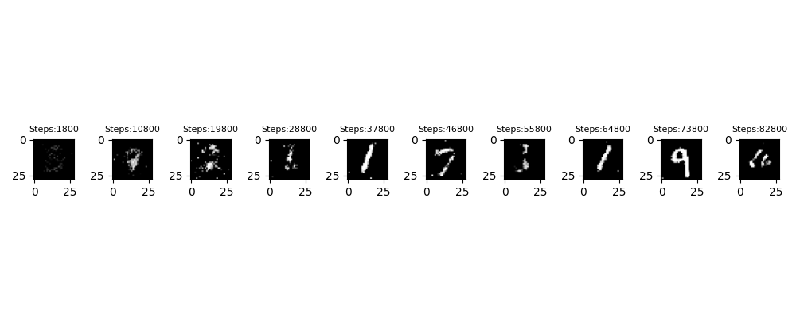
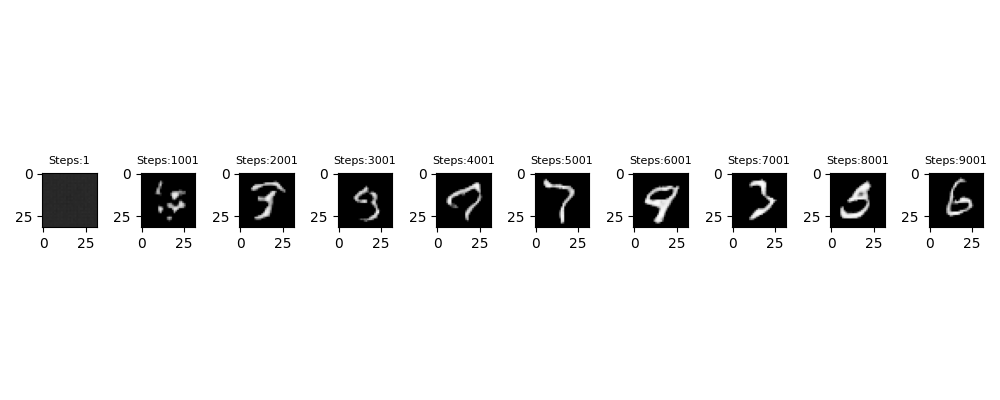
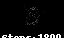
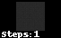

# Introduction

The Generative Adversarial Network (GAN) is a deep learning architecture used for generating new data samples that resemble a given dataset. GANs have gained popularity in the field of computer vision, natural language processing and many other fields for their ability to generate high-quality synthetic data.

In this project, I have used the MNIST dataset for training a GAN to generate new images of handwritten digits. These images are then used to augment the existing dataset and improve the performance of a CNN classifier.

## Dataset
* The MNIST dataset is a widely used benchmark dataset in the field of machine learning. It consists of a collection of 70,000 grayscale images of handwritten digits, each of size 28x28 pixels. This dataset has been instrumental in training and evaluating various image classification algorithms and has played a crucial role in advancing the field of deep learning.

# What is GAN?
* Generative Adversarial Networks (GANs) are a class of machine learning models that are used for generating new data that resembles a given training dataset. GANs consist of two components: a generator network that generates samples and a discriminator network that evaluates the authenticity of the generated samples. These networks are trained simultaneously in a competitive manner, where the generator aims to produce realistic samples that can fool the discriminator. The original GAN framework was introduced by Ian Goodfellow et al. in their 2014 paper titled "Generative Adversarial Networks," which can be accessed at https://arxiv.org/abs/1406.2661.

# Methodology

I have used PyTorch deep learning library for implementing the GAN architecture. The generator model takes a random noise vector as input and generates an image of a handwritten digit. The discriminator model receives an image as input and predicts whether the image is real or generated by the generator.

I have used the Adam optimizer with a learning rate of 0.0002 for training both the generator and discriminator. The GAN is trained for 100 epochs with a batch size of 128.

After training the GAN, I have used the generated images to augment the existing MNIST dataset.

# Results

Simple GAN

Self Attention GAN

Training Simple GAN

Training Self Attention GAN